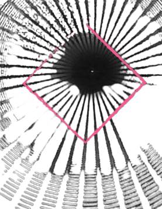

# Deeper - HackMyVM (Easy)

## Übersicht

*   **VM:** Deeper
*   **Plattform:** [HackMyVM](https://hackmyvm.eu/machines/machine.php?vm=Deeper)
*   **Schwierigkeit:** Easy
*   **Autor der VM:** DarkSpirit
*   **Datum des Writeups:** 27. September 2023
*   **Original-Writeup:** https://alientec1908.github.io/Deeper_HackMyVM_Easy/
*   **Autor:** Ben C.

## Kurzbeschreibung

Das Ziel dieser "Easy"-Challenge war es, Root-Zugriff auf der Maschine "Deeper" zu erlangen. Der Angriff begann mit der Enumeration eines Webservers, auf dem durch Directory Indexing im `/img/`-Verzeichnis und Analyse des Quellcodes der Seite `/deeper/` Hinweise (Morsecode, Hex-String) gefunden wurden. Diese führten zu den Zugangsdaten (`alice:IwillGoDeeper`) für einen SSH-Login. Als `alice` wurde die User-Flag und eine Datei (`.bob.txt`) mit Hinweisen auf das Passwort des Benutzers `bob` gefunden. Nach dem Wechsel zu `bob` wurde eine passwortgeschützte `root.zip`-Datei im Home-Verzeichnis entdeckt. Die ZIP-Datei wurde auf die Angreifer-Maschine übertragen, das Passwort (`bob`) mit `zip2john` und `john` geknackt. Die extrahierte Datei enthielt das Root-Passwort (`IhateMyPassword`), womit schließlich via `su root` Root-Rechte erlangt und die Root-Flag gelesen werden konnte.

## Disclaimer / Wichtiger Hinweis

Die in diesem Writeup beschriebenen Techniken und Werkzeuge dienen ausschließlich zu Bildungszwecken im Rahmen von legalen Capture-The-Flag (CTF)-Wettbewerben und Penetrationstests auf Systemen, für die eine ausdrückliche Genehmigung vorliegt. Die Anwendung dieser Methoden auf Systeme ohne Erlaubnis ist illegal. Der Autor übernimmt keine Verantwortung für missbräuchliche Verwendung der hier geteilten Informationen. Handeln Sie stets ethisch und verantwortungsbewusst.

## Verwendete Tools

*   `arp-scan`
*   `nikto`
*   `nmap`
*   `gobuster`
*   `wget`
*   `stegseek`
*   `stegsnow`
*   `steghide`
*   `strings`
*   `dirb`
*   `wfuzz`
*   `ssh`
*   `CyberChef` (oder manuelle Dekodierung)
*   `find`
*   `su`
*   `nc` (netcat)
*   `zip2john`
*   `john` (John the Ripper)
*   `unzip`
*   Standard Linux-Befehle (`vi`, `cat`, `ls`, `id`, `cd`)

## Lösungsweg (Zusammenfassung)

Der Angriff auf die Maschine "Deeper" gliederte sich in folgende Phasen:

1.  **Reconnaissance & Web Enumeration:**
    *   IP-Findung mittels `arp-scan` (Ziel: `192.168.2.132`, Hostname `deeper.hmv`).
    *   `nikto` und `nmap` identifizierten SSH (22/tcp) und einen Apache-Webserver (80/tcp). Nikto fand Directory Indexing im `/img/`-Verzeichnis.
    *   `gobuster` und `dirb` bestätigten das `/img/`-Verzeichnis. Im Quellcode der `index.html` fand sich der Hinweis `G "deeper"`.
    *   Im Verzeichnis `/img/` wurden die Bilder `index.jpg`, `index2.jpg` und `index3.jpg` gefunden. Steganographie-Versuche auf diese Bilder mit `stegseek`, `stegsnow` und `steghide` waren zunächst erfolglos.
    *   Die Untersuchung der Webseite `/deeper/` (basierend auf dem Hinweis) offenbarte im Quellcode Kommentare:
        *   Morsecode für `USER: ALICE`.
        *   Ein Hex-kodierter String, der nach Dekodierung (Hex -> Base64 -> ASCII) das Passwort `IwillGoDeeper` ergab. Dieses stand auch als Klartext-Kommentar daneben.

2.  **Initial Access (SSH als alice):**
    *   Mit den gefundenen Zugangsdaten (`alice:IwillGoDeeper`) wurde ein erfolgreicher SSH-Login durchgeführt.
    *   Als `alice` wurden keine `sudo`-Rechte gefunden. Die User-Flag (`user.txt`) und eine Datei `.bob.txt` wurden im Home-Verzeichnis entdeckt.

3.  **Lateral Movement (von alice zu bob):**
    *   Die Datei `.bob.txt` enthielt einen kodierten String (Hex -> Base64 -> ASCII) und den Klartext `IamDeepEnough`, das Passwort für den Benutzer `bob`.
    *   Ein Home-Verzeichnis für `bob` wurde unter `/home` bestätigt.
    *   Mittels `su bob` und dem Passwort `IamDeepEnough` wurde erfolgreich zum Benutzer `bob` gewechselt.

4.  **Privilege Escalation (von bob zu root):**
    *   Als `bob` wurden ebenfalls keine `sudo`-Rechte gefunden. Im Home-Verzeichnis von `bob` wurde die Datei `root.zip` entdeckt.
    *   Da `unzip` und `python` auf dem Zielsystem nicht verfügbar waren, wurde `root.zip` mittels `nc` auf die Angreifer-Maschine übertragen.
    *   Auf der Angreifer-Maschine wurde mit `zip2john root.zip > hash` der Passwort-Hash der ZIP-Datei extrahiert.
    *   `john --wordlist=/usr/share/wordlists/rockyou.txt hash` knackte das ZIP-Passwort zu `bob`.
    *   Die Datei `root.zip` wurde mit dem Passwort `bob` entpackt. Sie enthielt `root.txt` mit dem Inhalt `root:IhateMyPassword`.
    *   Zurück auf der Zielmaschine (als `bob`) wurde mit `su root` und dem Passwort `IhateMyPassword` erfolgreich Root-Zugriff erlangt.
    *   Die finale Root-Flag wurde aus `/root/root.txt` gelesen.

## Wichtige Schwachstellen und Konzepte

*   **Information Disclosure im Webseiten-Quellcode:** Zugangsdaten (`alice:IwillGoDeeper`) wurden durch Kommentare und leicht dekodierbare Strings im Quelltext preisgegeben.
*   **Directory Indexing:** Ermöglichte das Auffinden zusätzlicher Bilddateien im `/img/`-Verzeichnis.
*   **Schwache Passwörter:** Das Passwort `IamDeepEnough` für `bob` und das ZIP-Passwort `bob` waren schwach. Das Root-Passwort `IhateMyPassword` war ebenfalls nicht stark.
*   **Unsichere Speicherung von Zugangsdaten:** Das Passwort für `bob` war in einer Textdatei im Home-Verzeichnis von `alice` gespeichert. Das Root-Passwort war in einer schwach passwortgeschützten ZIP-Datei im Home-Verzeichnis von `bob` gespeichert.
*   **Steganographie (Versuch):** Obwohl mehrere Versuche unternommen wurden, war Steganographie nicht der primäre Weg, sondern die Hinweise lagen im Quellcode und in Dateiinhalten.

## Flags

*   **User Flag (`/home/alice/user.txt`):** `7e267b737cc121c29b496dc3bcffa5a7`
*   **Root Flag (`/root/root.txt`):** `dbc56c8328ee4d00bbdb658a8fc3e895`

## Tags

`HackMyVM`, `Deeper`, `Easy`, `Web`, `Apache`, `Information Disclosure`, `Source Code Analysis`, `Morse Code`, `Hex Encoding`, `Base64`, `SSH`, `Password Cracking`, `zip2john`, `John the Ripper`, `Privilege Escalation`, `Lateral Movement`, `Linux`
